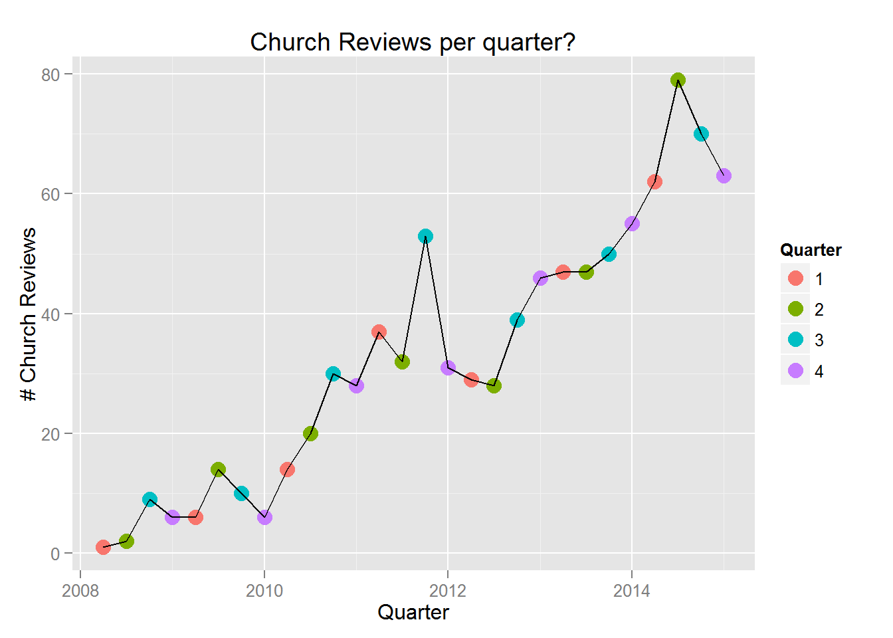

<link rel="stylesheet" href="//cdnjs.cloudflare.com/ajax/libs/github-fork-ribbon-css/0.1.1/gh-fork-ribbon.min.css" />
<!--[if lt IE 9]>
  <link rel="stylesheet" href="//cdnjs.cloudflare.com/ajax/libs/github-fork-ribbon-css/0.1.1/gh-fork-ribbon.ie.min.css" />
<![endif]-->

  

    <a href="https://github.com/jeremyrsellars/Church.Insights.Yelp">Fork me on GitHub</a>
  

  
Insights from Church Reviews on Yelp
========================================================
author: Jeremy Sellars
date: November 20, 2015

This slide deck summarizes my research.

### Click below for the Full Report:
### [Insights from Church Reviews on Yelp](https://github.com/jeremyrsellars/Church.Insights.Yelp/blob/master/ChurchReviews.md)

(Not interested in Churches?  [Fork the code](https://github.com/jeremyrsellars/Church.Insights.Yelp) and change it to your liking.)

What can church leaders glean from yelp reviews?
========================================================

Aside from reading the reviews of their own church and sister churches,
**is there additional information that can help?**

- I thought Yelp was for businesses.  **Do people even review churches?**
- When do people review churches? Is there one season that should be emphasized?  **When are people most likely to check out a church?**

Do people even review churches?
========================================================
People review churches throughout the year.  As Yelp has gained popularity, more and more people review businesses (and churches) online, each month adding to the total number of reviews.

When do people evaluate (new) churches?
========================================================
We see from this table that the highest proportion of Church reviews occurs from **July through September**.  This is the season where people are most often evaluating churches.

|Quarter |Months  | PerMillion|Percentage |
|:-------|:-------|----------:|:----------|
|1       |Jan-Mar |        484|21%        |
|2       |Apr-Jun |        563|25%        |
|3       |Jul-Sep |        639|28%        |
|4       |Oct-Dec |        585|26%        |
Churches may want to **emphasize their core values and ministries** during this period to attract people with matching needs.

Methods & Data
========================================================
One of the key assumptions to further analysis of Yelp data is **whether or not the yelp community reviews churches on par with the other businesses they review.**  To verify the church reviews are consistent with expected community behavior, **a linear regression model is fit to the data.**

The **[Yelp dataset](https://www.yelp.com/dataset_challenge)** includes a list of businesses, some of which are categorized as "Churches".  This research looks at Yelp reviews from 2008-2014 from 10 cities.

