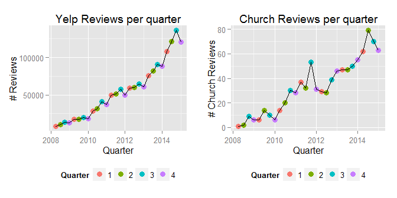

Introduction
------------

Can Yelp reviews be used to uncover trends in how people perceive churches and when they are thinking about churches? This document takes on three specific trends that may be of interest to sociologists, parishoners, and church leadership:

1.  How often are churches reviewed on Yelp?
2.  Is there a particularly important season when more people evaluate (review) churches?
3.  How favorable are Yelp reviews to churches?

Methods and Data
----------------

This research is all about reviews of churches. The [Yelp dataset](https://www.yelp.com/dataset_challenge) includes a list of businesses, some of which are categorized as "Churches". Only reviews about these church "businesses" are considered in this evaluation. There is Yelp data from 2007, however since no churches were reviewed until 2008, only reviews from 2008-2014 are considered in this analysis.

There are 914 reviews from 123 churches represented across these 10 cities:

-   U.K.: Edinburgh
-   Germany: Karlsruhe
-   Canada: Montreal and Waterloo
-   U.S.: Pittsburgh, Charlotte, Urbana-Champaign, Phoenix, Las Vegas, Madison

1.  The Yelp community has grown and changed over time, so it is important to compare the growth in church reviews compared to the overall growth in Yelp reviews across all categories. A linear model is fit to the data.
2.  Next, an analysis of the time of year people evaluate churches is performed to see whether one quarter of the year is more important for a church to emphasize their distinctive qualities and values. A linear model is fit to the church review counts per quarter, accounting for seasonal differences between quarters (people's business, holidays, etc.). This is shown as a trend line.
3.  Last, the star-ratings of reviews are compared to show how favorably reviewers see churches.

Results
-------

### A Rising Tide Lifts All Boats (Yelp Usage Trends)

The following diagrams approximate the popularity of Yelp over time from 2008-01-01 to 2015-01-01. Notice how the basic shape of the two graphs are similar, though the scale is quite different. Approximately 2.3 reviews per 1000 are reviews of churches.

This table shows the number of church reviews per million reviews, to show the number of church reviews is proportionate to the total number of reviews in all categories.

|  Year|  PerMillionReviews|
|-----:|------------------:|
|  2008|               1443|
|  2009|               1977|
|  2010|               2619|
|  2011|               2896|
|  2012|               2322|
|  2013|               2371|
|  2014|               2260|

### Church Reviews Over Time

It is helpful to account for the popularity of Yelp over time.

The correlation between number of church reviews vs. all reviews per quarter through time is 0.9604229. This high correlation indicates there is a very strong relationship between the number of church reviews vs. reviews in all categories.

#### Linear Model

Fitting a linear model to the data, the proportion of church reviews is slowly gaining ground against other sectors at a rate of 0.000577 review per year overall. The p-value is very small at 5.94073017831751e-16, so we reject the null hypothesis that the number of church reviews is unrelated to the number of reviews in all sectors (Yelp popularity). In other words, the odds are really low that it's a coincidence that as there were more and more reviews, more churches were reviewed.

### When Do People Evaluate Churches?

It has been said that you only get one chance to make a first impression. Is there a particular time of year when more reviews occur? This may correspond to when people are visiting churches, possibly with the intent of becoming a regular attendee.

Accounting for the growth in Yelp popularity, we can compare the church reviews by quarter.

| Quarter | Months  |  PerMillion| Percentage |
|:--------|:--------|-----------:|:-----------|
| 1       | Jan-Mar |         484| 21%        |
| 2       | Apr-Jun |         563| 25%        |
| 3       | Jul-Sep |         639| 28%        |
| 4       | Oct-Dec |         585| 26%        |

The third quarter seems to be the most important time to make a good impression, while Q1 seems to be slightly less important.

### Church Favorability Trends

The Yelp reviews include a star rating which indicates how favorable the reviewer is to the church. This chart accounts for the disproportionate number of Yelp reviews through the years by comparing percentages of the different favorability (stars).

Discussion
----------

1.  It is clear that people are reviewing churches on Yelp and that as the popularity of Yelp grew, church reviews increased as well.
2.  The third quarter may be the most important time for a church to really show what they value, though people review year-round, so being consistent is certainly important.
3.  How favorable are Yelp reviews to churches? Reviews are becoming increasingly favorable, although in the most recent years people have become willing to give a poor review rather than staying silent.
4.  At approximately 7 reviews per church spread across 7 years, individual churches probably don't need to do data analysis of their church's reviews. However, at 91 reviews per city, the city in which a church ministers may have enough data to warant statistical analysis.

**Assumptions:**

-   The data in the Yelp data-set is representative of the cities represented, and may not represent the reader's city. The demographics of cities differ from one another. Smaller communities may behave differently or have different concerns.
-   The "Church reviews over time" section, which compared church reviews vs. all reviews, assumes that the data-set is complete, or was randomly selected from the available data.

**Conclusion:**

This analysis shows that Yelp data can be mined for valuable insights for churches that are concerned with making a good impression.
